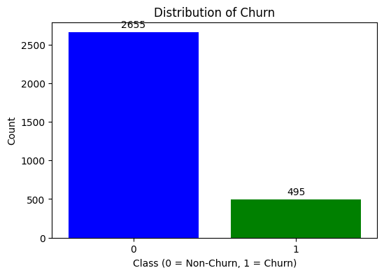
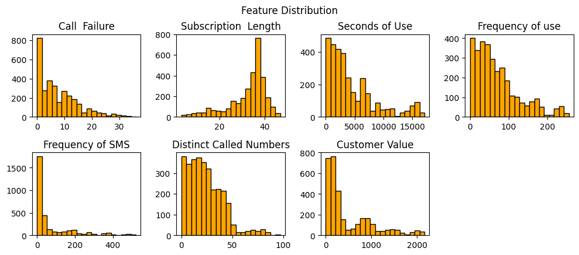
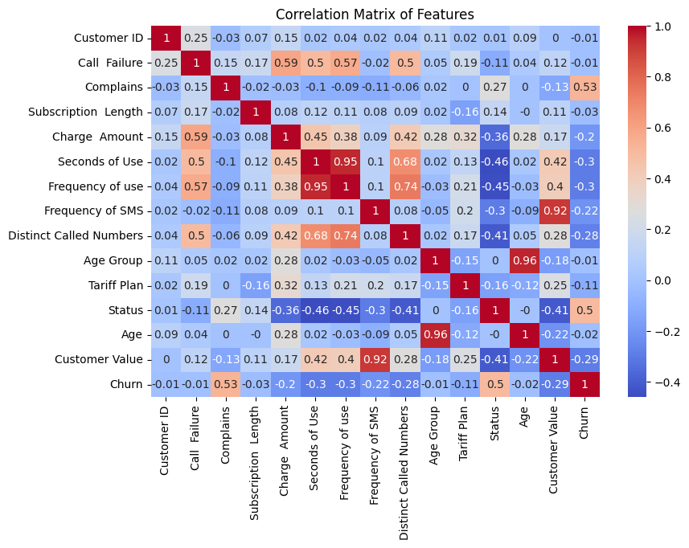
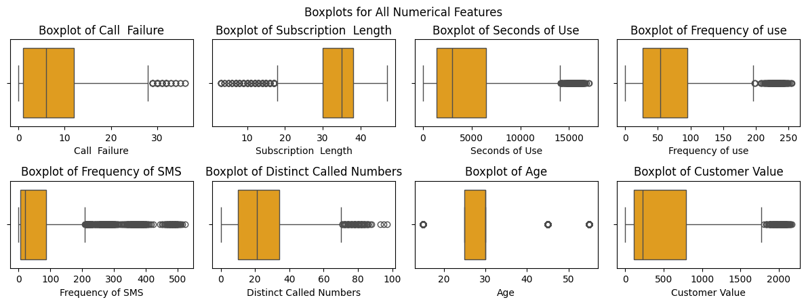
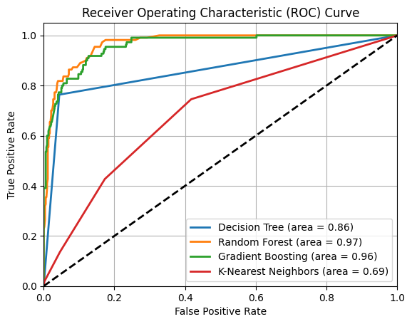

# Telecom-Customer-Churn-Prediction
A machine learning project predicting telecom customer churn using Random Forest, Gradient Boosting, and other models.

This project focuses on predicting customer churn in a telecom company using machine learning. The goal is to identify customers likely to leave, allowing the business to take preventive actions and improve retention.

1. Introduction
Customer churn is a critical issue in the telecom industry. Retaining customers is more cost-effective than acquiring new ones. This project analyzes customer behavior and usage data to develop a predictive model that identifies churners using algorithms such as Random Forest, Gradient Boosting, Decision Tree, and K-Nearest Neighbors.

2. Data Overview
The dataset includes 3,150 records containing demographic and service-related details such as subscription length, usage behavior, complaints, and customer value.
Churn Distribution
The dataset shows a class imbalance, where only a small percentage of customers have churned.
Image: churn_distribution.png

3. Exploratory Data Analysis (EDA)
Feature distributions were analyzed to understand customer behavior patterns. Most customers have low call failures and moderate subscription lengths, while a small group of heavy users stands out.
Image: feature_distribution.png

4. Correlation Analysis
A correlation matrix was used to identify relationships between variables. Complaints, Status, and Charge Amount show the strongest correlation with churn, while higher Customer Value reduces the likelihood of leaving.
Image: correlation_matrix.png

5. Data Preprocessing
Data cleaning steps included handling duplicates, treating outliers, and encoding categorical features.
Outliers were capped at the 1st and 99th percentiles, and log transformations were applied to skewed variables.
Image: outlier_boxplot.png

6. Model Development
Four models were trained and evaluated based on accuracy, precision, recall, and F1-score.
Model	Accuracy	Precision	Recall	F1-Score
Decision Tree	0.86	0.77	0.78	0.77
Random Forest	0.93	0.85	0.74	0.79
Gradient Boosting	0.92	0.83	0.75	0.78
KNN	0.69	0.62	0.58	0.60
The Random Forest model performed best overall with 93% accuracy.
ROC Curve
The ROC curve below shows Random Forest achieving the best performance among all models.
Image: roc_curve.png

7. Key Insights
•	Customers with frequent complaints are more likely to churn.
•	High-value customers and those with consistent usage tend to stay.
•	The model can help reduce churn by approximately 25% if applied strategically.

8. Conclusion
The Random Forest model provides reliable churn predictions and offers valuable insights for business decisions.
By focusing on resolving complaints, re-engaging inactive customers, and rewarding loyal ones, telecom companies can reduce churn and increase profitability.

9. Technologies Used
•	Python
•	Pandas, NumPy
•	Matplotlib, Seaborn
•	Scikit-learn

